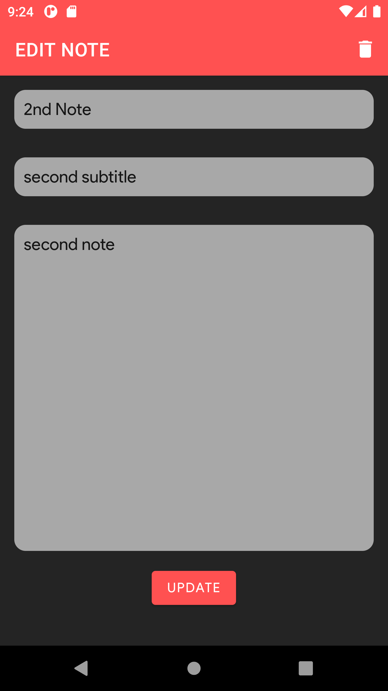
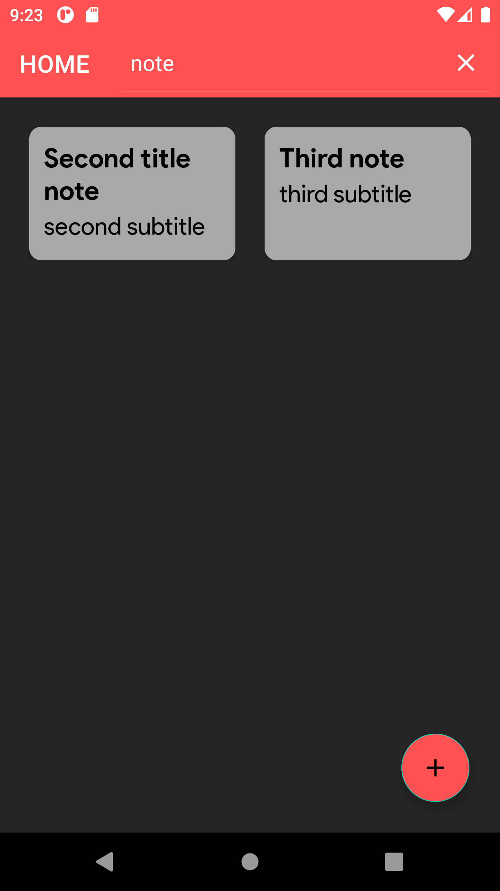

## NOTES TAKING| Kotlin Coroutines | Room, MVVM, Navigation, Databinding | 

This app has.

1. Navigation Component
2. DataBinding
3. Fragments
4. Kotlin coroutines.
5. Room
6. MVVM.
7. Search View 

### Splash Screen

### HOME 

### Create Note 

### Edit Note

### Search View

